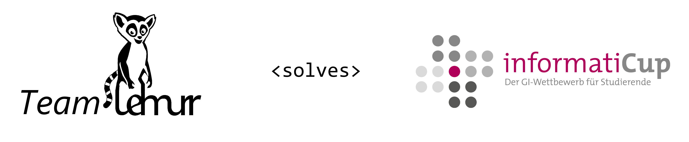

# spe-ed-solver by team Lehnurr

[German Readme](README.de-DE.md)

This repository contains Team Lehnurr's solution for the [InformatiCup:2021](https://github.com/informatiCup/informatiCup2021)

## Available data

| Description                          | Data                                                                                               |
| ------------------------------------ | -------------------------------------------------------------------------------------------------- |
| Sourcecode                           | [spe-ed-solver directory](spe-ed-solver)                                                           |
| Docker Files + Guide                 | [.docker directory](.docker)                                                                       |
| Documentation + User manual          | [ausarbeitung_informaticup2021_lehnurr.pdf](elaboration/ausarbeitung_informaticup2021_lehnurr.pdf) |
| Project documentation                | [spe-ed-docs.lehnurr.de](https://spe-ed-docs.lehnurr.de/index.html)                        |
| Sourcecode documentation             | [spe-ed-docs.lehnurr.de/apidocs](https://spe-ed-docs.lehnurr.de/apidocs/index.html)                |
| Branch for documenation source files | [gh-pages branch](https://github.com/Lehnurr/spe-ed-solver/tree/gh-pages)                          |
| Python Prototype                     | [spe-ed-solver-prototype](https://github.com/Lehnurr/spe-ed-solver-prototype)                      |

## Build

The Java 11 JDK and maven are required to compile the project. Other dependencies are provided automatically by maven. Just call

`mvn package -f spe-ed-solver/pom.xml`

To Build a Docker Image you can call

`docker build --pull --rm -f ".docker/Dockerfile" -t teamlehnurr/spe-ed-solver:latest "."`

## Run

You can run the project with docker or java 11.

- For docker you can pull the image with `docker pull teamlehnurr/spe-ed-solver:latest`
- For java download a released [`core-<Version>-jar-with-dependencies.jar`](https://github.com/Lehnurr/spe-ed-solver/releases)

Further information about the cli and configuration are available in the [user manual](elaboration/ausarbeitung_informaticup2021_lehnurr.pdf) and the [.docker/README file](/.docker).

## Further information

To avoid information overload, only project-related information is included in this README file. Further, technical information can be found in the README's of the subdirectories.

## Contact

Feel free to contact us: [team@lehnurr.de](mailto:team@lehnurr.de)

[Team Lehnurr](https://team.lehnurr.de)
